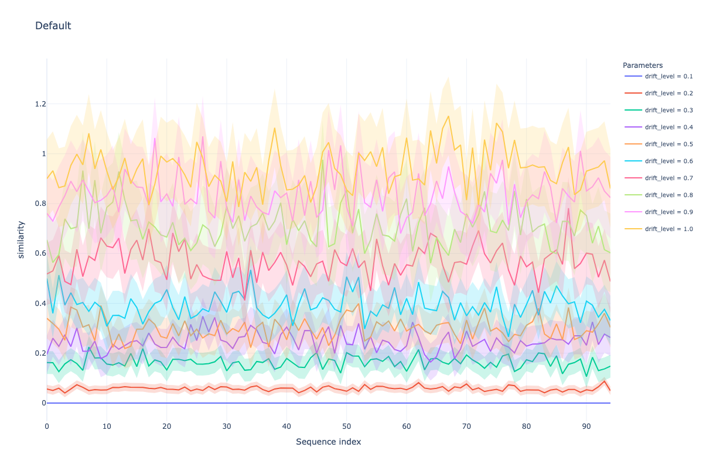
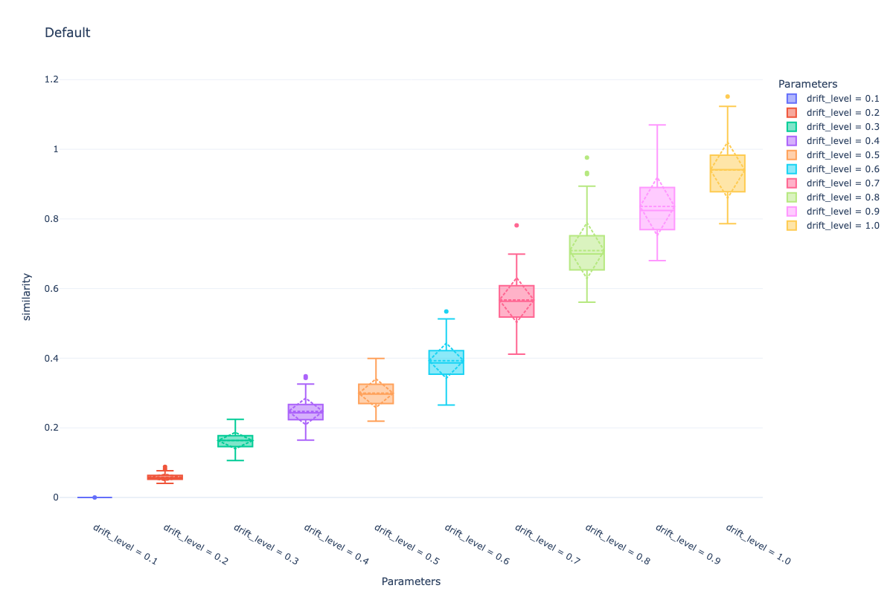

# Image Drift Generator

The image drift generator allow to introduce a synthetic drift on images from an input dataset. The dataset structure should be organized by class, where each class is a folder containing the images:

```
    input_path
        |--- class1
        |--- class2
        |--- ...
        |--- classN
```

The generator will produce an output folder with the following structure:

```
    output_path
        |--- sampled_images.zip
        |--- input_mapping.parquet
        |--- target.parquet
        |--- embeddings.parquet (if compute_embeddings is True)
```

The `sampled_images.zip` will be structured according to the `organize_by_class` parameter:

- `organize_by_class=False`: (Default) folder containing all the images, without a class folder structure
- `organize_by_class=True`: folder containing all the images, organized by class, following the input folder structure.

The `input_mapping.parquet` file will contain the mapping between the original image path and the generated one and presents the following columns:

- `sample_id` (i64): unique identifier for the sample
- `timestamp`(f64): timestamp of the sample
- `file_name` (str): file name of the new image

The `target.parquet` file will contain the target information for each sample and presents the following columns:

- `sample_id` (i64): unique identifier for the sample
- `timestamp` (f64): timestamp of the sample
- `label` (i64): the class label of the sample. The `CLASS_MAPPING` parameter can be used to map the original class labels to new ones.

The `embeddings.parquet` file will contain the embeddings of the generated images, if the `compute_embeddings` parameter is set to `True`. The file will contain the following columns:

- `sample_id` (i64): unique identifier for the sample
- `timestamp` (f64): timestamp of the sample
- `embedding` (array[f64, 512]): the embeddings of the image

### How does the generator work?

The generator will sample images from the input folder and store generated ones into a zip file. An example of workflow is the following:

1. Instantiate the generator with the input path, a seed and the compute_embeddings parameter.
   ```py
    img_path = '/data/places/'
    seed = 42
    compute_embeddings = True
    image_generator = ImageDatasetGenerator(
        seed=seed, input_path=img_path, compute_embeddings=compute_embeddings
    )
   ```
2. Define a set of transformations to be applied to the images. The generator supports the following transformations:
   - `GaussianBlur`: apply a Gaussian blur to the image
   - `GaussianNoise`: apply Gaussian noise to the image
   - `Brightness`: apply a random brightness to the image
   - `Contrast`: apply a random contrast to the image
   - `Rotation`: apply a random rotation to the image
   - `Hue`: apply a random hue to the image
   - `Saturation`: apply a random saturation to the image
   - `Default`: apply a combination of `GaussianBlur` and `GaussianNoise` that allow to explore the KL divergence spectrum directly through the drift level.
     Tranformations can be combined in a list and controlled by a specific `drift_level`. For example, we can define a list with all possible transformations:
   ```py
    transform_list = [
    TransformInfo(
        transf_type=ImageTransform.ROTATE,
        drift_level=0.9,
    ),
    TransformInfo(
        transf_type=ImageTransform.BRIGHTNESS,
        drift_level=0.3,
    ),
    TransformInfo(
        transf_type=ImageTransform.CONTRAST,
        drift_level=0.1,
    ),
    TransformInfo(
        transf_type=ImageTransform.HUE,
        drift_level=0.1,
    ),
    TransformInfo(
        transf_type=ImageTransform.SATURATION,
        drift_level=0.5,
    ),
    TransformInfo(
        transf_type=ImageTransform.GAUSSIAN_BLUR,
        drift_level=0.1,
    ),
    TransformInfo(
        transf_type=ImageTransform.GAUSSIAN_NOISE,
        drift_level=1.0,
    ),
   ]
   ```
3. Call the `add_abrupt_drift` method to instanciate a transformation pipeline. This method supports two modes:

   - `transform_list`: given a list of transformations, the method will instantiate a transformation pipeline, relying on the availabe transformations listed in the class.

   ```python
    image_generator.add_abrupt_drift(
    transform_list=transform_list,
   )
   ```

4. Finally, by calling the `sample` method you will generate the images and store them in the output folder along with the input mapping and target parquet files and the embeddings if required.

   ```python
    output_path = '/data/places_drifted/'
    organize_by_class = True
    data_category = image_generator.sample(
        output_path=output_path,
        organize_by_class=organize_by_class,
    )
   ```

## Default Transformations Results

Here we show the results of the default transformations applied to the images. The metric is the KL divergence between the original and the transformed images. The KL divergence is computed using the ResNet18 model, pretrained on ImageNet, and the embeddings are extracted from the second-to-last layer of the model. The KL divergence is computed on the embeddings of the images.

First, we show a line plot of KL divergence over batches of images. The x-axis represents the batch number, while the y-axis represents the KL divergence. The plot shows the KL divergence for each drift level applied to the images.



Second, we show a box plot of KL divergence over batches of images. The x-axis represents the drift level, while the y-axis represents the KL divergence. The plot shows the distribution of the KL divergence for each drift level applied to the images.


